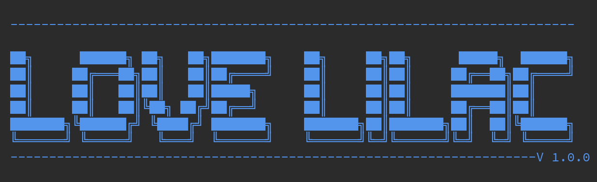
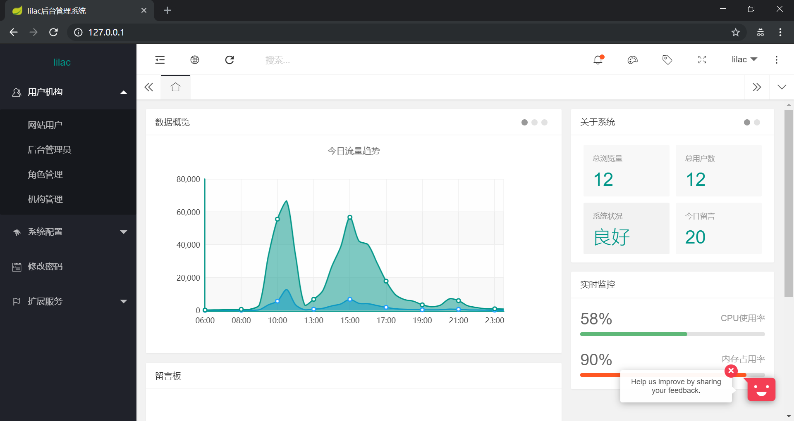
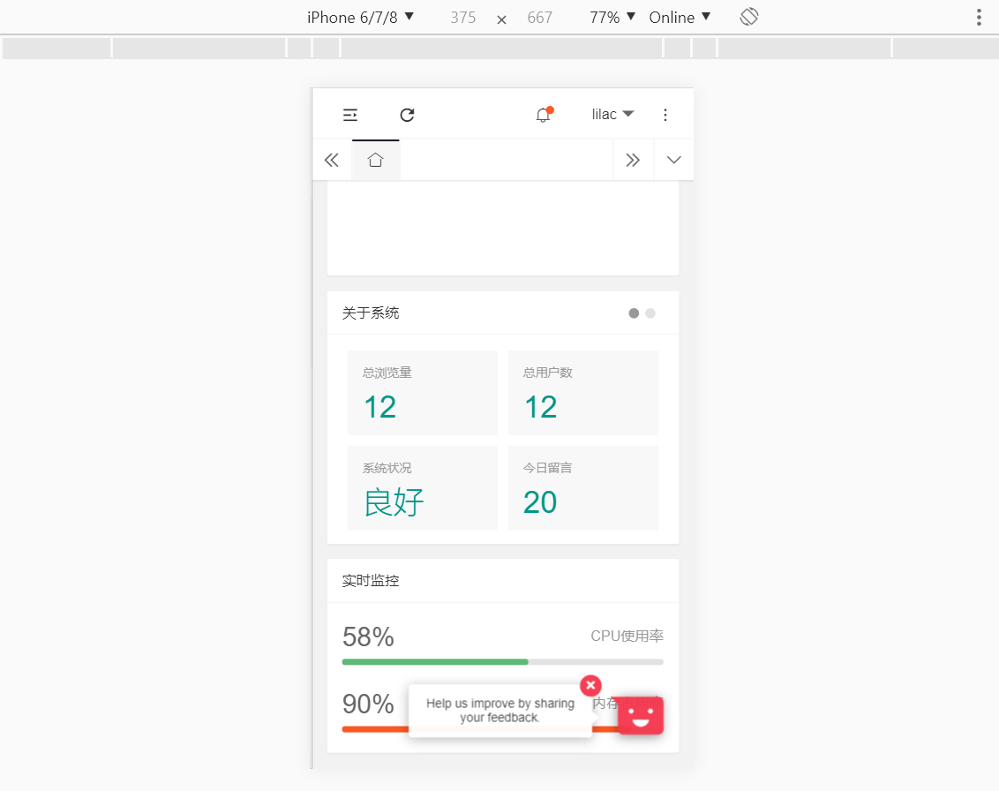
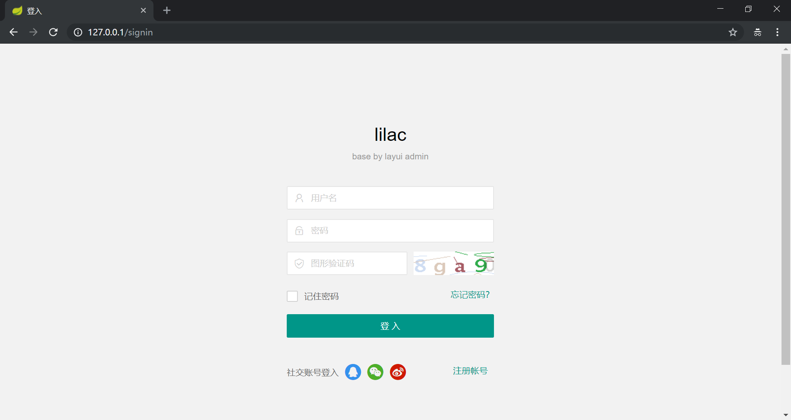
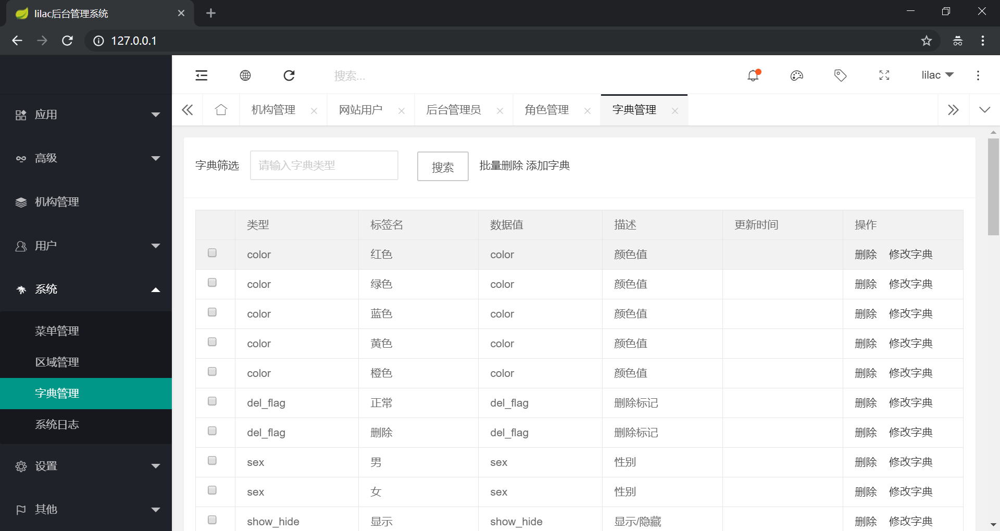
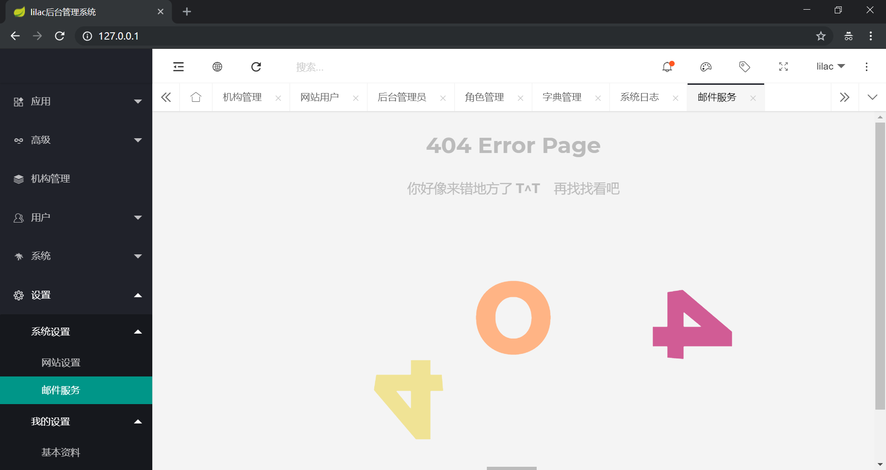

### LiLac 丁香花 -V 1.0.0 

> 打造企业级通用框架，简单易用。 邮箱:qianboy233@gmail.com 
#### 实现功能
> 基于springboot 2.0
* 页面支持响应式
* jwt校验，提供前后端分离服务
* 定时任务
* 菜单，字典，区域配置
* 发送邮件，采用丰富的模板
* mybatis代码生成，可视化界面。
* sql，性能监控
* flyway数据库版本控制
* swagger接口展示文档 
* 异步工具库封装处理
* 丰富可立即采用的工具库，零依赖
* 基于shiro开发实现权限控制
* 系统日志，操作记录存储,日志可提供下载
* ehcatch缓存

#### 页面展示

#### TODO
* 后端基础管理页面
* 功能完善

   
